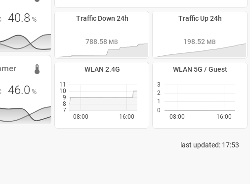
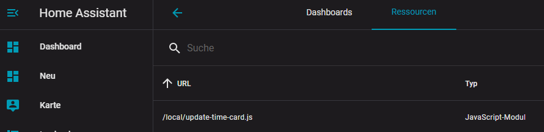

# update-time-card
A small display of the current time to be used with screenshots, e.g. for an e-ink dashboard. This way you will always know when the dashboard has updated.

Based on https://github.com/fufar/simple-clock-card

@fufar provided a fantastic card which I customized for my purposes. 

Changes include: 
- "last updated:" as a prefix to the time
- smaller font size by default
- aligned to the right, to be used at the bottom right of your dashboard
- no background / no box-shadow for the card
- seconds hidden by default

  

# Installation:

<b>Manual installation:</b>

1. Copy update-time-card.js into your 'www' folder in the hass config directory. The *'www'* folder can be accesed via *'/local/'* in your configuration.
2. Enable advanced mode and in your lovelace dashboard settings (settings -> lovelace dashboards -> resources)
3. Add a resource 
4. Set the lovelace panel

# Set lovelace panel

Add the following lines to a view in '*cards:*' as a *'manual card'* or use your yaml configuration and add:

		- type: 'custom:update-time-card'

Remember Home Assistant likes to cache. Use a private browser tab or clean your cache if you experience issues.

## Options
|option| default|description|
|--|--|--|
|  use_millitary| true| When true shows a 24h format clock instead of a 12h format clock with AM/ PM|
|  hide_seconds| false| When true hides the seconds
|  font_size| 4rem| Size of the font in rem. Units of measurement is required|
|  padding_size| 32px| Size of the lovelace field in px. Units of measurement is required|
